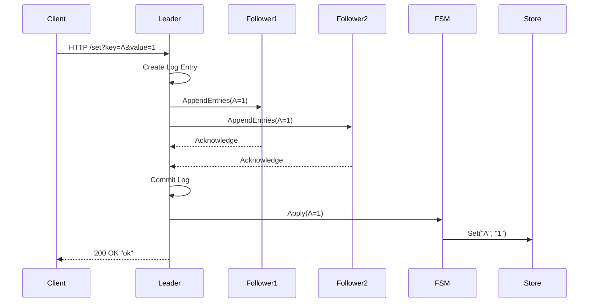

# Distributed Cache Service

High-performance distributed cache in Go using Raft for consensus and Consistent Hashing for sharding.

## Architecture Patterns

- **Sharding**: Consistent Hashing (Ring) to minimize keys remap.
- **Consensus**: Raft (Leader-Follower) for strong consistency within a shard.
- **Storage**: In-Memory Thread-Safe Map with TTL support.
- **API**: HTTP (Fallback) / gRPC (Planned).

## API Documentation

### 1. Set Key
Sets a value for a key. This operation is replicated via Raft.

- **Endpoint**: `GET /set` (for demo convenience, typically POST)
- **Parameters**:
  - `key`: The key to set.
  - `value`: The value to store.
  - `ttl`: (Optional) Time to live in seconds.
- **Response**: `ok` or error message.

### 2. Get Key
Retrieves a value. This operation is strongly consistent (read from Leader for simple implementation).

- **Endpoint**: `GET /get`
- **Parameters**:
  - `key`: The key to retrieve.
- **Response**: The value string or `not found`.

### 3. Join Cluster
Adds a new node to the Raft cluster.

- **Endpoint**: `GET /join`
- **Parameters**:
  - `node_id`: Unique ID of the new node.
  - `addr`: Raft address of the new node (e.g., `127.0.0.1:11000`).
- **Response**: `joined` or error message.

## Sequence Diagram: Write Operation



## Running Tests

### Unit Tests
```bash
go test ./internal/...
```

### Performance Benchmark
```bash
go test -bench=. ./internal/store
```
