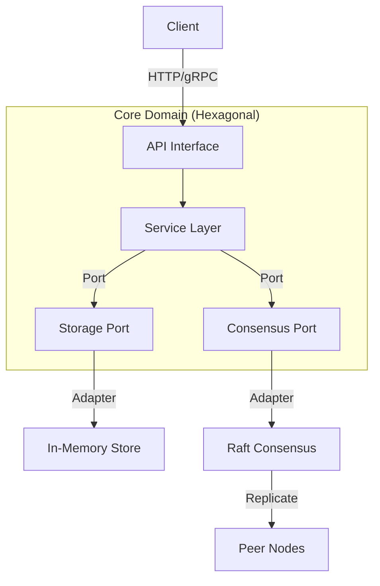
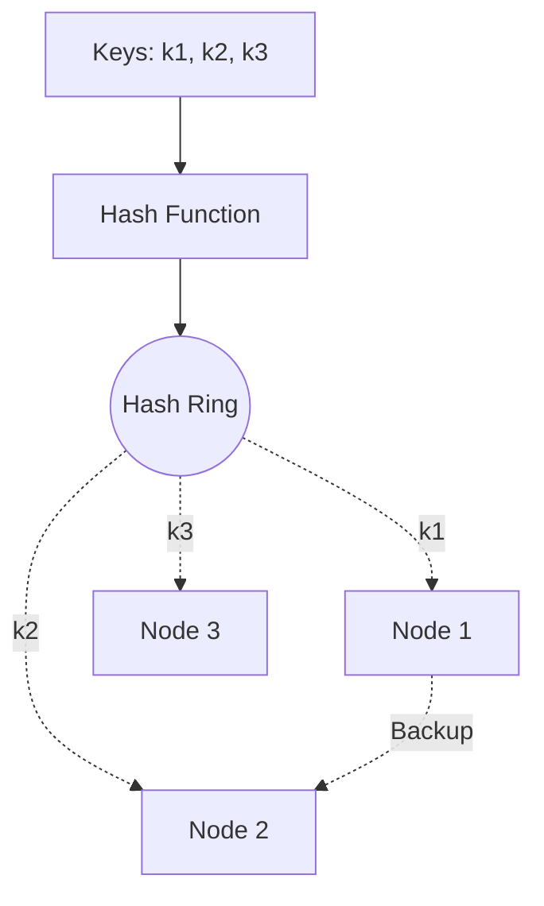
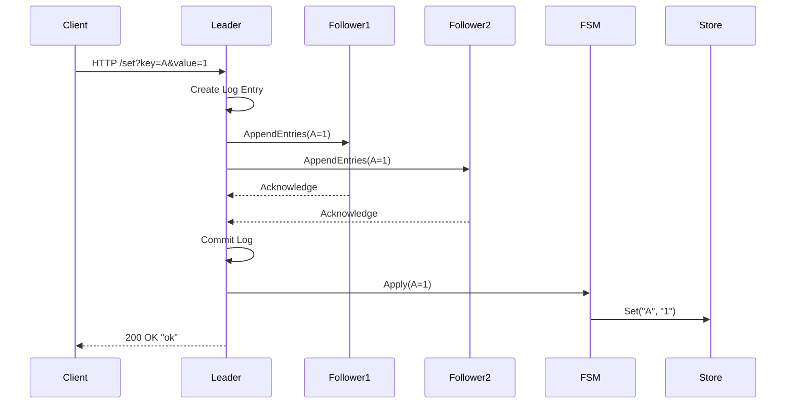

# Distributed Cache Service

High-performance distributed cache service written in Go, designed for scalability, fault tolerance, and extensibility.

## Project Overview

This project implements a production-grade distributed key-value store inspired by systems like Etcd and Dynamo. It is built to handle high throughput and ensure data consistency across a cluster of nodes. The system leverages **Raft consensus** for replication and **Consistent Hashing** for efficient data distribution (sharding).

Designed with **Hexagonal Architecture** (Ports and Adapters), the core business logic is decoupled from external dependencies (like the network transport or storage engine), making the codebase highly maintainable and easy to extend.

### Key Features

*   **Distributed Consistency**: Uses the HashiCorp Raft implementation to ensure strong consistency (Leader-Follower model) and automatic failover.
*   **Scalable Sharding**: Implements Consistent Hashing with virtual nodes to evenly distribute data and minimize rebalancing noise during scaling events.
*   **In-Memory Storage**: High-performance, thread-safe in-memory store with support for Time-To-Live (TTL) and automatic expiration.
*   **Hexagonal Architecture**: Clean separation of concerns using Ports and Adapters to support future upgrades (e.g., swapping HTTP for gRPC or MemoryStore for BadgerDB).
*   **Production Ready**: Includes Kubernetes manifests for StatefulSet deployment, Docker containerization, and comprehensive metrics/profiling hooks (`pprof`).

## Architecture Patterns

- **Hexagonal Architecture (Ports & Adapters)**:
  - **Core**: Business logic in `internal/core/service`.
  - **Ports**: Interfaces defined in `internal/core/ports`.
  - **Adapters**: `consensus` (Raft), `store` (Memory), and `cmd/server` (HTTP) act as adapters.
- **Sharding**: Consistent Hashing (Ring) to minimize keys remap.
- **Consensus**: Raft (Leader-Follower) for strong consistency within a shard.
- **Storage**: In-Memory Thread-Safe Map with TTL support.
- **API**: HTTP (Fallback) / gRPC (Planned).

### Architecture Diagram



### Consistent Hashing Ring



## Project Structure

```
├── cmd
│   └── server          # Main entry point for the application
├── internal
│   ├── consensus       # Raft implementation and FSM adapter
│   ├── core
│       ├── ports       # Interfaces for Service, Storage, and Consensus
│       └── service     # Business logic and Command definitions
│   ├── sharding        # Consistent Hashing implementation
│   └── store           # In-Memory key-value store implementation
├── k8s                 # Kubernetes manifests (StatefulSet, Service)
├── proto               # Protobuf definitions (for future gRPC)
└── raft_data           # Directory for Raft logs and snapshots (created at runtime)
```

## Configuration

The server accepts the following command-line flags:

| Flag              | Default      | Description                                      |
|-------------------|--------------|--------------------------------------------------|
| `-node_id`        | `node1`      | Unique identifier for the Raft node.             |
| `-http_addr`      | `:8080`      | Address to bind the HTTP server.                 |
| `-raft_addr`      | `:11000`     | Address to bind the Raft transport.              |
| `-raft_advertise` | `""`         | Advertised Raft address (defaults to local IP).  |
| `-raft_dir`       | `raft_data`  | Directory to store Raft data (logs/snapshots).   |
| `-bootstrap`      | `false`      | Set to `true` to bootstrap a new cluster (leader).|
| `-join`           | `""`         | Address of an existing leader to join.           |

## Deployment

### Kubernetes (Production)

1. **Build the Docker Image**:
   ```bash
   docker build -t distributed-cache-service:latest .
   ```

2. **Deploy to Cluster**:
   ```bash
   kubectl apply -f k8s/
   ```

3. **Verify Deployment**:
   ```bash
   kubectl get pods -l app=cache-service
   kubectl logs cache-node-0
   ```

### Deployment: Render (Free Tier)

**Render** offers a free tier for Web Services, but it does **not** support persistent disks on the free plan. This means if the service restarts, **data will be lost**. Use this only for stateless demos.

**Steps:**
1.  Push this code to a GitHub repository.
2.  Sign up at [render.com](https://render.com).
3.  Click **New +** -> **Blueprint**.
4.  Connect your repository.
5.  Render will automatically detect `render.yaml` and deploy (defaulting to PORT 8000).


To run a 3-node cluster locally:

**Node 1 (Leader):**
```bash
./server -node_id node1 -http_addr :8081 -raft_addr :11001 -raft_dir raft_node1 -bootstrap
```

**Node 2 (Follower):**
```bash
./server -node_id node2 -http_addr :8082 -raft_addr :11002 -raft_dir raft_node2 -join localhost:8081
```

**Node 3 (Follower):**
```bash
./server -node_id node3 -http_addr :8083 -raft_addr :11003 -raft_dir raft_node3 -join localhost:8081
```

## API Documentation

### 1. Set Key
Sets a value for a key. This operation is replicated via Raft.

- **Endpoint**: `GET /set` (for demo convenience, typically POST)
- **Parameters**:
  - `key`: The key to set.
  - `value`: The value to store.
  - `ttl`: (Optional) Time to live in seconds.
- **Response**: `ok` or error message.

### 2. Get Key
Retrieves a value. This operation is strongly consistent (read from Leader for simple implementation).

- **Endpoint**: `GET /get`
- **Parameters**:
  - `key`: The key to retrieve.
- **Response**: The value string or `not found`.

### 3. Join Cluster
Adds a new node to the Raft cluster.

- **Endpoint**: `GET /join`
- **Parameters**:
  - `node_id`: Unique ID of the new node.
  - `addr`: Raft address of the new node (e.g., `127.0.0.1:11000`).
- **Response**: `joined` or error message.

## Usage Examples

**Start the Server:**
```bash
./server -node_id node1 -http_addr :8080 -raft_addr :11000 -raft_dir raft_node1 -bootstrap
```

**Write a Value:**
```bash
curl "http://localhost:8080/set?key=hello&value=world"
```

**Read a Value:**
```bash
curl "http://localhost:8080/get?key=hello"
```

## Sequence Diagram: Write Operation



## Running Tests

### Unit Tests
```bash
go test ./internal/...
```

### Performance Benchmark
```bash
go test -bench=. ./internal/store
```

## Profiling

The service exposes `pprof` endpoints at `/debug/pprof/`.

### 1. CPU Profile
```bash
go tool pprof http://localhost:8080/debug/pprof/profile?seconds=30
```

### 2. Heap (Memory) Profile
```bash
go tool pprof http://localhost:8080/debug/pprof/heap
```

### 3. Goroutine Blocking Profile
```bash
go tool pprof http://localhost:8080/debug/pprof/block
```

## Path to 10M RPS (Scaling Strategy)

Achieving 10 Million Requests Per Second requires evolving this MVP with the following architectural optimizations:

1.  **Multi-Raft / Sharded Consensus**:
    - **Current**: Single Raft group for the whole cluster.
    - **Bottleneck**: Leader becomes the write bottleneck.
    - **Solution**: Split data into partitions (Ranges/Shards). Each partition has its own Raft Consensus Group. This allows writes to scale linearly with the number of nodes (like CockroachDB or TiKV).

2.  **Smart Client (Client-Side Routing)**:
    - **Current**: Client talks to any node (or one via DNS).
    - **Solution**: Clients should fetch the **Hash Ring / Partition Map** and route requests directly to the correct node (or Leader for writes), eliminating an extra network hop.

3.  **Transport Layer Optimization**:
    - **Current**: HTTP/JSON.
    - **Solution**: Switch to **gRPC with Protobuf** for smaller payload size and connection multiplexing. For extreme low latency, consider custom binary protocols over TCP/UDP.

4.  **Hardware & OS Tuning**:
    - Use High-Performance Networking (SR-IOV, DPDK) if CPU bound.
    - Kernel tuning: `SO_REUSEPORT`, increased file descriptors, TCP Fast Open.

5.  **Hot Key Handling**:
    - Implement **Local Caching** (Near Cache) on the client side for extremely hot keys.
    - Use "Shadow Replicas" to serve reads for hot keys from more nodes than just the consensus group.
