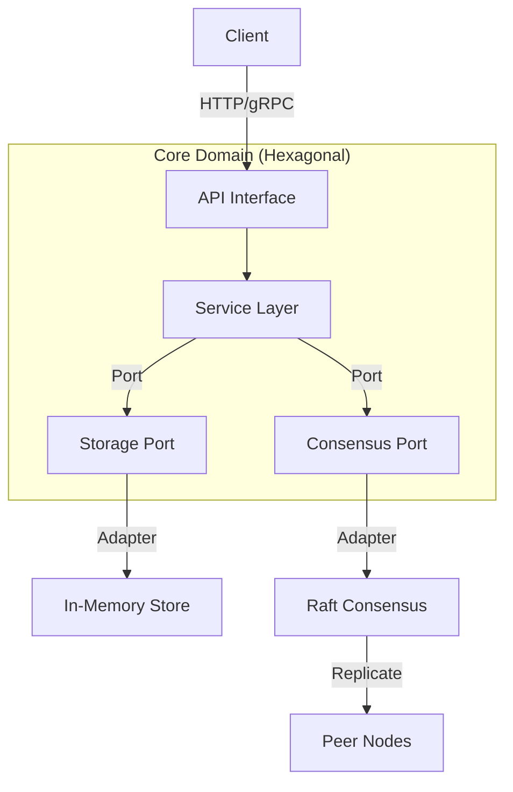
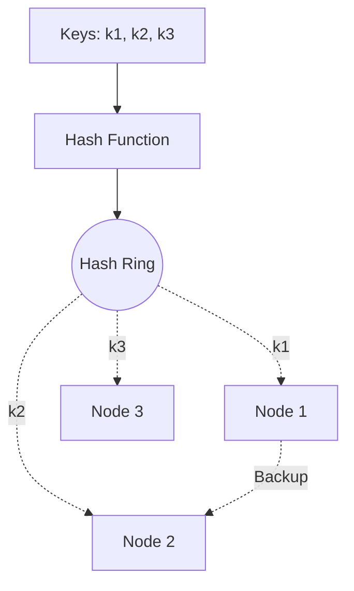
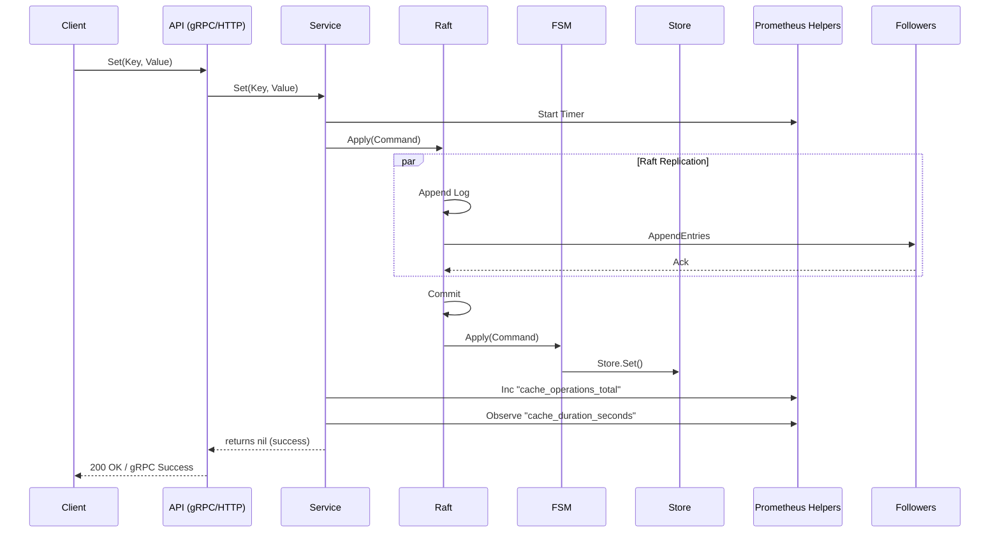
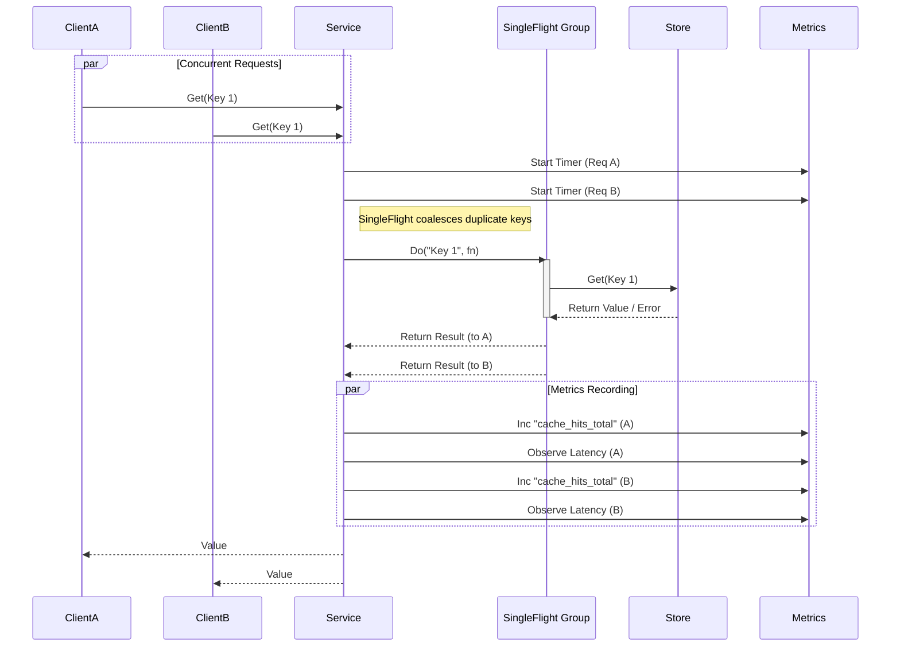

# Distributed Cache Service

High-performance distributed cache service written in Go, designed for scalability, fault tolerance, and extensibility.

## Project Overview

This project implements a production-grade distributed key-value store inspired by systems like Etcd and Dynamo. It is built to handle high throughput and ensure data consistency across a cluster of nodes. The system leverages **Raft consensus** for replication and **Consistent Hashing** for efficient data distribution (sharding).

Designed with **Hexagonal Architecture** (Ports and Adapters), the core business logic is decoupled from external dependencies (like the network transport or storage engine), making the codebase highly maintainable and easy to extend.

### Key Features

*   **Distributed Consistency**: Uses the HashiCorp Raft implementation to ensure strong consistency (Leader-Follower model) and automatic failover.
*   **Scalable Sharding**: Implements Consistent Hashing with virtual nodes to evenly distribute data and minimize rebalancing noise during scaling events.
*   **In-Memory Storage**: High-performance, thread-safe in-memory store with support for Time-To-Live (TTL) and automatic expiration.
*   **Concurrency Safe**: Implements **SingleFlight (Request Coalescing)** to prevent cache stampedes ("Thundering Herd") during high concurrent read pressure.
*   **Hexagonal Architecture**: Clean separation of concerns using Ports and Adapters to support future upgrades (e.g., swapping HTTP for gRPC or MemoryStore for BadgerDB).
*   **Production Ready**: Includes Kubernetes manifests for StatefulSet deployment, Docker containerization, and comprehensive metrics/profiling hooks (`pprof`).

## Architecture Patterns

- **Hexagonal Architecture (Ports & Adapters)**:
  - **Core**: Business logic in `internal/core/service`.
  - **Ports**: Interfaces defined in `internal/core/ports`.
  - **Adapters**: `consensus` (Raft), `store` (Memory), and `cmd/server` (HTTP) act as adapters.
- **Sharding**: Consistent Hashing (Ring) to minimize keys remap.
- **Consensus**: Raft (Leader-Follower) for strong consistency within a shard.
- **Storage**: In-Memory Thread-Safe Map with TTL support.
- **API**: HTTP (Fallback) / gRPC (Planned).

### Architecture Diagram



### Consistent Hashing Ring



## Project Structure

```
├── cmd
│   └── server          # Main entry point for the application
├── internal
│   ├── consensus       # Raft implementation and FSM adapter
│   ├── core
│       ├── ports       # Interfaces for Service, Storage, and Consensus
│       └── service     # Business logic and Command definitions
│   ├── sharding        # Consistent Hashing implementation
│   └── store           # In-Memory key-value store implementation
├── k8s                 # Kubernetes manifests (StatefulSet, Service)
├── proto               # Protobuf definitions (for future gRPC)
└── raft_data           # Directory for Raft logs and snapshots (created at runtime)
```

## Configuration

The server accepts the following command-line flags:

| Flag              | Default      | Description                                      |
|-------------------|--------------|--------------------------------------------------|
| `-node_id`        | `node1`      | Unique identifier for the Raft node.             |
| `-http_addr`      | `:8080`      | Address to bind the HTTP server.                 |
| `-raft_addr`      | `:11000`     | Address to bind the Raft transport.              |
| `-raft_advertise` | `""`         | Advertised Raft address (defaults to local IP).  |
| `-raft_dir`       | `raft_data`  | Directory to store Raft data (logs/snapshots).   |
| `-bootstrap`      | `false`      | Set to `true` to bootstrap a new cluster (leader).|
| `-join`           | `""`         | Address of an existing leader to join.           |
| `-max_items`      | `0`          | Max items in cache `(0 = unlimited)`.            |
| `-eviction_policy`| `lru`        | Policy: `lru`, `fifo`, `lfu`, `random`.          |
| `-virtual_nodes`  | `100`        | Virtual nodes per physical node (Ring distribution).|
| `-consistency`    | `strong`     | Read consistency: `strong` (CP) or `eventual` (AP).|

## Eviction Policies

When `max_items` is set, the cache enforces capacity limits using the selected policy:

1.  **LRU (Least Recently Used)**: Default. Evicts items that haven't been accessed for the longest time. Best for general-purpose caching where recent items are most likely to be accessed again.
2.  **FIFO (First-In-First-Out)**: Evicts the oldest added items first. Useful when access patterns are strictly sequential or data freshness is determined by insertion order.
3.  **LFU (Least Frequently Used)**: Evicts items with the lowest access frequency. Ideal for keeping "popular" or "hot" items in cache regardless of how recently they were accessed.
4.  **Random**: Evicts a random item. Lowest CPU/Memory overhead (O(1)), suitable for very large datasets where probabilistic approximation is sufficient.

## Advanced Configuration

### 1. Tunable Consistency (`-consistency`)
The system implements a **Tunable Consistency** model for *Read Operations*, allowing operators to choose between consistency and latency based on their requirements (CAP Theorem).

> **Note**: *Write Operations* (`Set`, `Delete`) are **always Strongly Consistent** via Raft Quorum, regardless of this setting.

#### Mode A: Strong Consistency (`strong`) - Default
*   **Guarantee**: **Linearizability**. Clients are guaranteed to see the latest committed write. Stale reads are impossible.
*   **Design Mechanism (Read Lease)**:
    1.  Client sends `Get(Key)` to the Leader.
    2.  Leader calls `raft.VerifyLeader()`. This triggers a check to confirm it still holds the "Lease" (contact with a majority of nodes).
    3.  **Prevents Zombie Leaders**: If the Leader is partitioned, `VerifyLeader()` fails, and the request is rejected (500 Error) rather than returning old data.
    4.  If verified, Leader reads from local FSM.
*   **Trade-off**: Higher Latency (due to heartbeat check) & Reduced Availability (Fails during partitions).

#### Mode B: Eventual Consistency (`eventual`)
*   **Guarantee**: **Eventual Consistency**. Reads are fast but may be stale.
*   **Design Mechanism (Local Read)**:
    1.  Client sends `Get(Key)` to *any* node (Leader or Follower).
    2.  Node reads directly from its local in-memory FSM (`memStore`).
    3.  Returns value immediately without network chatter.
*   **Trade-off**: Lowest Latency & High Availability (Works even if disconnected from cluster), but risk of Stale Reads (if follower is lagging).

### 2. Virtual Nodes (`-virtual_nodes`)
Designed to prevent **Data Skew** in the Consistent Hashing ring.

#### Mechanics
*   **Without Virtual Nodes**: One node might get 50% of the key space.
*   **With 100 Virtual Nodes**: Each physical node is hashed 100 times (`node1_0` ... `node1_99`), interlacing them on the ring.
*   **Result**: Even distribution. Standard Deviation of keys per node drops significantly (e.g., from ~30k to ~1k keys variation).

#### Edge Cases
*   **Low Virtual Node Count** (e.g., `1`): If `node1` is adjacent to `node2` on the ring and `node2` leaves, `node1` might instantly inherit 50% of the traffic, causing a cascading failure (Hot Spot).
*   **Node Failure**: In a sharded setup (future), losing a physical node means losing 100 small segments. This spreads the recovery load across **all** remaining nodes rather than hammering just one neighbor.

### 3. Dynamic Membership (Joiner Mode)
The cluster does not require a static config. Nodes join dynamically via the Raft API.

#### Workflow
1.  **Bootstrap**: Start Server A with `-bootstrap`. It elects itself Leader.
2.  **Join Request**: Server B starts with `-join <Server A Address>`.
3.  **Raft Configuration Change**: Server A receives the join request, proposes a `AddVoter` configuration change to the Raft log.
4.  **Replication**: Once committed, Server B receives the snapshot and current logs, becoming a full voting member.

#### Edge Cases
*   **Leader Down during Join**: The join request will fail or timeout. The joining node must retry with a Backoff strategy until a new leader is elected.
*   **Joining a Follower**: Ideally, followers forward the request to the Leader. If not, the joining node receives a "Not Leader" error (and usually a hint about who the leader is).
*   **Duplicate Join**: Raft handles idempotency. If a node tries to join but is already a member, the operation is a no-op (success).

## Deployment

### Kubernetes (Production)

1. **Build the Docker Image**:
   ```bash
   docker build -t distributed-cache-service:latest .
   ```

2. **Deploy to Cluster**:
   ```bash
   kubectl apply -f k8s/
   ```

3. **Verify Deployment**:
   ```bash
   kubectl get pods -l app=cache-service
   kubectl logs cache-node-0
   ```

### Deployment: Render (Free Tier)

**Render** offers a free tier for Web Services, but it does **not** support persistent disks on the free plan. This means if the service restarts, **data will be lost**. Use this only for stateless demos.

**Steps:**
1.  Push this code to a GitHub repository.
2.  Sign up at [render.com](https://render.com).
3.  Click **New +** -> **Blueprint**.
4.  Connect your repository.
5.  Render will automatically detect `render.yaml` and deploy (defaulting to PORT 8000).


To run a 3-node cluster locally:

**Node 1 (Leader):**
```bash
./server -node_id node1 -http_addr :8081 -raft_addr :11001 -raft_dir raft_node1 -bootstrap -virtual_nodes 100 -consistency eventual
```

**Node 2 (Follower):**
```bash
./server -node_id node2 -http_addr :8082 -raft_addr :11002 -raft_dir raft_node2 -join localhost:8081 -virtual_nodes 100 -consistency eventual
```

**Node 3 (Follower):**
```bash
./server -node_id node3 -http_addr :8083 -raft_addr :11003 -raft_dir raft_node3 -join localhost:8081 -virtual_nodes 100 -consistency eventual
```

## API Documentation

### 1. Set Key
Sets a value for a key. This operation is replicated via Raft.

- **Endpoint**: `GET /set` (for demo convenience, typically POST)
- **Parameters**:
  - `key`: The key to set.
  - `value`: The value to store.
  - `ttl`: (Optional) Time to live in seconds.
- **Response**: `ok` or error message.

### 2. Get Key
Retrieves a value. This operation is **strongly consistent** (Linearizable Read). It verifies leadership before returning data to ensure no stale reads occur during partitions.

- **Endpoint**: `GET /get`
- **Parameters**:
  - `key`: The key to retrieve.
- **Response**: The value string or `not found`.

### 3. Join Cluster
Adds a new node to the Raft cluster.

- **Endpoint**: `GET /join`
- **Parameters**:
  - `node_id`: Unique ID of the new node.
  - `addr`: Raft address of the new node (e.g., `127.0.0.1:11000`).
- **Response**: `joined` or error message.

## Observability

The service exports Prometheus-compatible metrics at `/metrics`.

### 1. Collected Metrics

| Metric Name | Type | Labels | Description |
| :--- | :--- | :--- | :--- |
| `cache_hits_total` | Counter | None | Total number of successful cache lookups. |
| `cache_misses_total` | Counter | None | Total number of failed cache lookups. |
| `cache_operations_total` | Counter | `type` (get/set/delete)<br>`status` (success/error) | Total count of all cache operations. |
| `cache_duration_seconds` | Histogram | `type` (get/set/delete) | Latency distribution of operations. |

### 2. Access Metrics
You can scrape or view metrics using `curl`:

```bash
curl http://localhost:8080/metrics
```

## Usage Examples

**Start the Server (Strong Consistency & 100 Virtual Nodes):**
```bash
./server -node_id node1 -http_addr :8080 -raft_addr :11000 -raft_dir raft_node1 -bootstrap -virtual_nodes 100 -consistency strong
```

**Write a Value:**
```bash
curl "http://localhost:8080/set?key=hello&value=world"
```

**Read a Value:**
```bash
curl "http://localhost:8080/get?key=hello"
```

## Sequence Diagrams

### 1. Write Flow (Strong Consistency)
*Valid for `Set`, `Delete`, and `Join` operations.*



### 2. Read Flow (Eventual Consistency)
*Demonstrates **SingleFlight** (Request Coalescing) and **Observability**.*



## Running Tests

### Unit Tests
```bash
go test ./internal/...
```

### Performance Benchmark
```bash
go test -bench=. ./internal/store
```

## Profiling

The service exposes `pprof` endpoints at `/debug/pprof/`.

### 1. CPU Profile
```bash
go tool pprof http://localhost:8080/debug/pprof/profile?seconds=30
```

### 2. Heap (Memory) Profile
```bash
go tool pprof http://localhost:8080/debug/pprof/heap
```

### 3. Goroutine Blocking Profile
```bash
go tool pprof http://localhost:8080/debug/pprof/block
```

## gRPC Support (Planned/Proto Definitions)

The project includes Protocol Buffers definitions in `proto/cache.proto` to support future gRPC implementation.

### Why Protocol Buffers?
Using specific Proto definitions offers significant advantages over JSON/HTTP:

1.  **Strict Type Safety**: Ensures contracts between clients and servers are respected at compile time, reducing runtime errors.
2.  **High Performance**: Binary serialization is significantly smaller and faster to parse than JSON, which is critical for high-throughput caching systems.
3.  **Language Interoperability**: Protobuf allows generating client code in almost any language (C++, Java, Python, Rust) from the same definition.
4.  **Backward Compatibility**: Fields can be added or deprecated without breaking existing clients.

### Service Definition
The `CacheService` defines the following RPC methods:
- `Get(GetRequest) returns (GetResponse)`: Retrieve value by key.
- `Set(SetRequest) returns (SetResponse)`: Store value with TTL.
- `Delete(DeleteRequest) returns (DeleteResponse)`: Remove value.

### Generating Go Code
To generate the Go code from the proto definitions, install `protoc` and the Go plugins, then run:

```bash
protoc --go_out=. --go_grpc_out=. proto/cache.proto
```

## Path to 10M RPS (Scaling Strategy)

Achieving 10 Million Requests Per Second requires evolving this MVP with the following architectural optimizations:

1.  **Multi-Raft / Sharded Consensus**:
    - **Current**: Single Raft group for the whole cluster.
    - **Bottleneck**: Leader becomes the write bottleneck.
    - **Solution**: Split data into partitions (Ranges/Shards). Each partition has its own Raft Consensus Group. This allows writes to scale linearly with the number of nodes (like CockroachDB or TiKV).

2.  **Smart Client (Client-Side Routing)**:
    - **Current**: Client talks to any node (or one via DNS).
    - **Solution**: Clients should fetch the **Hash Ring / Partition Map** and route requests directly to the correct node (or Leader for writes), eliminating an extra network hop.

3.  **Transport Layer Optimization**:
    - **Current**: HTTP/JSON.
    - **Solution**: Switch to **gRPC with Protobuf** for smaller payload size and connection multiplexing. For extreme low latency, consider custom binary protocols over TCP/UDP.

4.  **Hardware & OS Tuning**:
    - Use High-Performance Networking (SR-IOV, DPDK) if CPU bound.
    - Kernel tuning: `SO_REUSEPORT`, increased file descriptors, TCP Fast Open.

5.  **Hot Key Handling**:
    - Implement **Local Caching** (Near Cache) on the client side for extremely hot keys.
## Contributing and Guardrails

To ensure code quality and stability, this project enforces strict development guardrails.

### 1. Local Checkpoint (Pre-Commit Hooks)
We use `pre-commit` to catch errors before they are committed.

**Setup:**
```bash
pip install pre-commit
pre-commit install
```

Now, every `git commit` will automatically run:
- Formatting (`gofmt`)
- Linting (`golangci-lint`)
- Unit Tests
- `go vet`

### 2. Remote Checkpoint (Branch Protection)
The "main" branch is protected. Pull Requests cannot be merged unless:
1.  **CI Pipeline Passes**: The `CI Success` status check must succeed. This check aggregates all quality, security, and test jobs.
2.  **Code Owner Review**: (Optional) Approval from a maintainer is required.

**How to Configure (Repo Admin):**
1.  Go to `Settings` -> `Branches`.
2.  Click `Add rule` for `main`.
3.  Check:
    - `Require status checks to pass before merging`.
    - Search and select: `CI Success`.
    - `Require a pull request before merging`.
